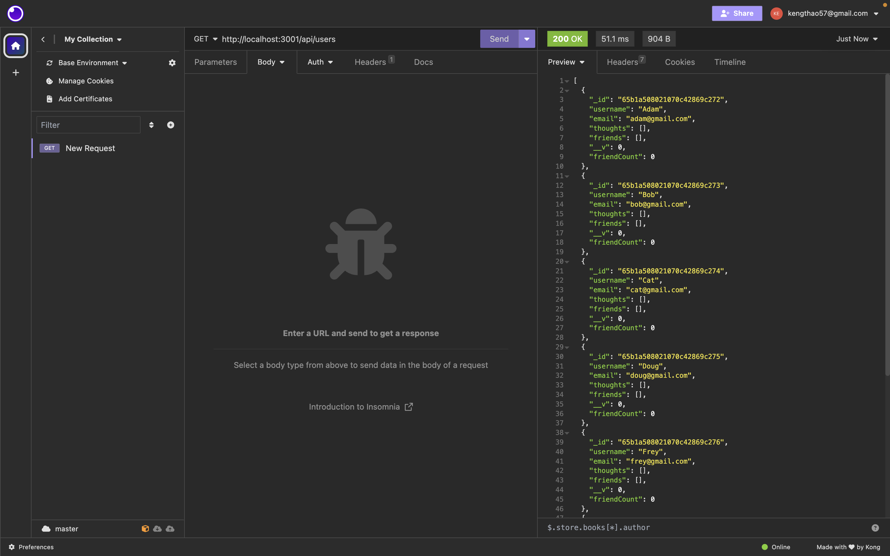
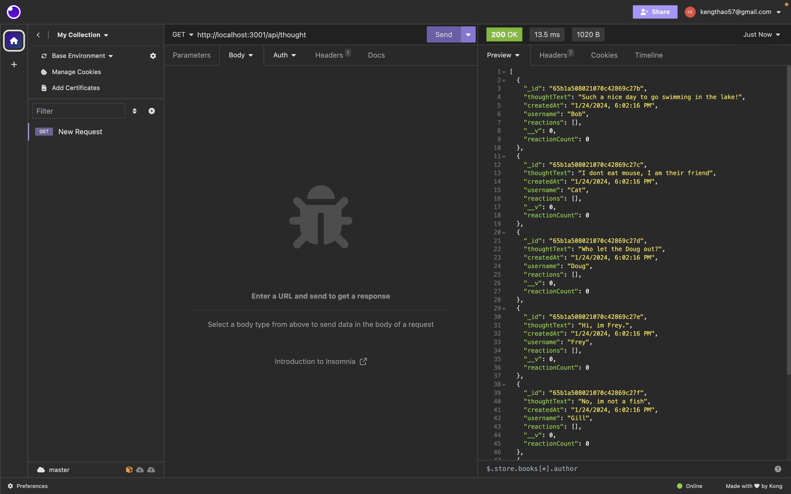

# Networking But Online API

## Description

This is a social networking API app for users who would like to share their thoughts, react to their friends' thought as well as having a friend's list. 

## User Story

```
AS A social media startup
I WANT an API for my social network that uses a NoSQL database
SO THAT my website can handle large amounts of unstructured data
```

## Acceptance Criteria

```
GIVEN a social network API
WHEN I enter the command to invoke the application
THEN my server is started and the Mongoose models are synced to the MongoDB database
WHEN I open API GET routes in Insomnia for users and thoughts
THEN the data for each of these routes is displayed in a formatted JSON
WHEN I test API POST, PUT, and DELETE routes in Insomnia
THEN I am able to successfully create, update, and delete users and thoughts in my database
WHEN I test API POST and DELETE routes in Insomnia
THEN I am able to successfully create and delete reactions to thoughts and add and remove friends to a user’s friend list
```

## Screenshots/Videos

[CLICK HERE TO SEE DEMO](https://www.awesomescreenshot.com/video/24345783?key=49ce4d22509ba567667c891406d098c0)







## Usage/Installation

```
ownload this code

npm install express

npm install mongoose

npm start

open it through insomnia

```

## Credits

```
Javascript

Mongoose

Express

Insomnia

Node.js

Github

```

## Author

Feel free to visit my Github Repository [@Kthao29](https://github.com/Kthao29)
